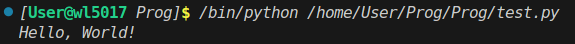

# Отчёт
## Задание

1. Создайте репозиторий для дисциплины на GitHub.
2. Склонируйте его себе на ПК.
3. Напишите свою первую программу.
4. Запустите её.
5. Сделайте коммит и пуш.
6. Напишите отчёт в README.md.
7. Добавьте для себя в отчёт шпаргалку по работе с git.

## Описание проделанной работы

1. Выполнены все пункты задания
2. Была написанна программа на языке Python, выводащая строку "Hello, World!"
```python
print("Hello, World!")
```


## Список использованных источников:
https://evil-teacher.orbiter.website/prog_pm/lab00/