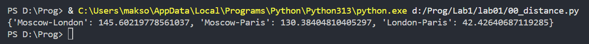
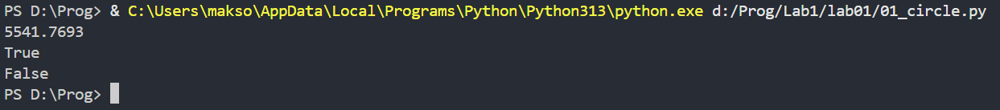
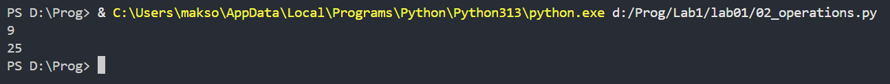
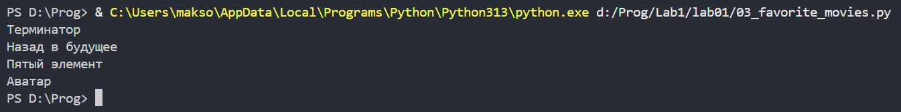
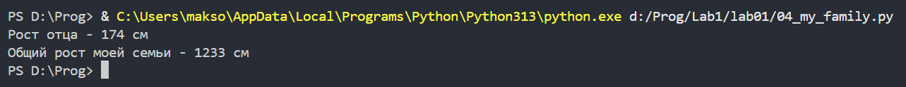
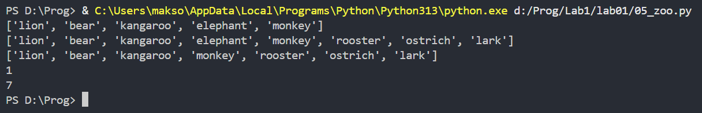
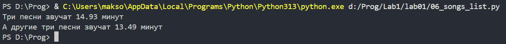
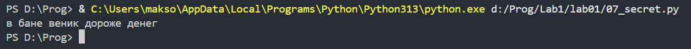
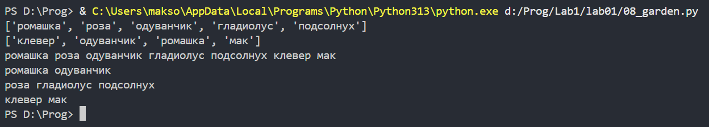
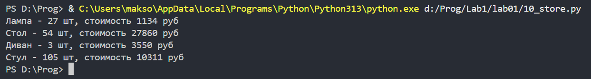

# Отчёт
## Задание 0
Есть словарь координат городов
```python
sites = {
    'Moscow': (550, 370),
    'London': (510, 510),
    'Paris': (480, 480),
}
```
Составить словарь словарей расстояний между ними, используя формулу нахождения расстояния на координатной сетке: ((x1 - x2) ** 2 + (y1 - y2) ** 2) ** 0.5
```python
distances = {
    'Moscow-London':(((sites['Moscow'][0] - sites['London'][0]) ** 2 + (sites['Moscow'][1] - sites['London'][1]) ** 2) ** 0.5),
    'Moscow-Paris' :(((sites['Moscow'][0] - sites['Paris'][0]) ** 2 + (sites['Moscow'][1] - sites['Paris'][1]) ** 2) ** 0.5),
    'London-Paris' :(((sites['London'][0] - sites['Paris'][0]) ** 2 + (sites['London'][1] - sites['Paris'][1]) ** 2) ** 0.5)
}
```
Результат:

## Задание 1
Есть значение радиуса круга
```python
radius = 42
```
Выведите на консоль значение прощади этого круга с точностю до 4-х знаков после запятой
```python
circle_area = 3.1415926 * radius**2
print(round(circle_area, 4))
```
Далее, пусть есть координаты точки
```python
point_1 = (23, 34)
```
Если точка point лежит внутри того самого круга [центр в начале координат (0, 0), radius = 42], то выведите на консоль True, Или False, если точка лежит вовне круга
```python
distance_p1 = (point_1[0]**2 + point_1[1]**2) ** 0.5
print(distance_p1 <= radius)
```
Аналогично для другой точки
```python
point_2 = (30, 30)
distance_p2 = (point_2[0]**2 + point_2[1]**2) ** 0.5
print(distance_p2 <= radius)
```
Результат:

## Задание 2
Расставьте знаки операций "плюс", "минус", "умножение" и скобки между числами "1 2 3 4 5" так, что бы получилось число "25"
```python
result_25 = 1 * (2 + 3) + 4 * 5
print(result_25)
```
Результат:

## Задание 3
Есть строка с перечислением фильмов
```python
my_favorite_movies = 'Терминатор, Пятый элемент, Аватар, Чужие, Назад в будущее'
```
Выведите на консоль с помощью индексации строки, последовательно:
первый фильм,
последний,
второй,
второй с конца
```python
print(my_favorite_movies[0:10])
print(my_favorite_movies[42:57])
print(my_favorite_movies[12:25])
print(my_favorite_movies[27:33])
```
Результат:

## Задание 4
Создайте списки:
моя семья (минимум 3 элемента, есть еще дедушки и бабушки, если что),
```python
my_family = ['dad', 'mum', 'old_brother_1', 'old_brother_2', 'me', 'young_brother', 'young_sister']
```
список списков приблизителного роста членов вашей семьи
```python
my_family_height = [
    # ['имя', рост],
    ['Алексей', 174],
    ['Лариса', 165],
    ['Марк', 182],
    ['Макарий', 186],
    ['Максим', 184],
    ['Миша', 178],
    ['Маша', 164]
]
```
Выведите на консоль рост отца в формате: Рост отца - ХХ см
```python
print(f'Рост отца - {my_family_height[0][1]} см')
```
Выведите на консоль общий рост вашей семьи как сумму ростов всех членов
```python
summ = my_family_height[0][1]+my_family_height[1][1]+my_family_height[2][1]+my_family_height[3][1]+my_family_height[4][1]+my_family_height[5][1]+my_family_height[6][1]
print(f'Общий рост моей семьи - {summ} см')
```
Результат:

## Задание 5
есть список животных в зоопарке
```python
zoo = ['lion', 'kangaroo', 'elephant', 'monkey', ]
```
посадите медведя (bear) между львом и кенгуру и выведите список на консоль
```python
zoo.insert(1, 'bear')
print(zoo)
```
добавьте птиц из списка birds в последние клетки зоопарка и выведите список на консоль
```python
birds = ['rooster', 'ostrich', 'lark', ]
zoo += birds
print(zoo)
```
уберите слона и выведите список на консоль
```python
zoo.remove('elephant')
print(zoo)
```
выведите на консоль в какой клетке сидит лев (lion) и жаворонок (lark). Номера при выводе должны быть понятны простому человеку, не программисту.
```python
print(zoo.index('lion') + 1)
print(zoo.index('lark') + 1)
```
Результат:

## Задание 6
Есть список песен группы Depeche Mode со временем звучания с точностью до долей минут
```python
violator_songs_list = [
    ['World in My Eyes', 4.86],
    ['Sweetest Perfection', 4.43],
    ['Personal Jesus', 4.56],
    ['Halo', 4.9],
    ['Waiting for the Night', 6.07],
    ['Enjoy the Silence', 4.20],
    ['Policy of Truth', 4.76],
    ['Blue Dress', 4.29],
    ['Clean', 5.83],
]
```
распечатайте общее время звучания трех песен: 'Halo', 'Enjoy the Silence' и 'Clean' в формате:
Три песни звучат ХХХ.XX минут
```python
sum1 = violator_songs_list[3][1]+violator_songs_list[5][1]+violator_songs_list[8][1]
print(f'Три песни звучат {round(sum1,2)} минут')
```
Есть словарь песен группы Depeche Mode
```python
violator_songs_dict = {
    'World in My Eyes': 4.76,
    'Sweetest Perfection': 4.43,
    'Personal Jesus': 4.56,
    'Halo': 4.30,
    'Waiting for the Night': 6.07,
    'Enjoy the Silence': 4.6,
    'Policy of Truth': 4.88,
    'Blue Dress': 4.18,
    'Clean': 5.68,
}
```
распечатайте общее время звучания трех песен: 'Sweetest Perfection', 'Policy of Truth' и 'Blue Dress'
```python
sum2 = violator_songs_dict['Sweetest Perfection']+violator_songs_dict['Policy of Truth']+violator_songs_dict['Blue Dress']
print(f'А другие три песни звучат {round(sum2, 2)} минут')
```
Результат:

## Задание 7
Есть зашифрованное сообщение
```python
secret_message = [
    'квевтфпп6щ3стмзалтнмаршгб5длгуча',
    'дьсеы6лц2бане4т64ь4б3ущея6втщл6б',
    'т3пплвце1н3и2кд4лы12чф1ап3бкычаь',
    'ьд5фму3ежородт9г686буиимыкучшсал',
    'бсц59мегщ2лятьаьгенедыв9фк9ехб1а',
]
```
Нужно его расшифровать и вывести на консоль в удобочитаемом виде. Должна получиться фраза на русском языке, например: как два байта переслать.
Ключ к расшифровке:
первое слово - 4-я буква;
второе слово - буквы с 10 по 13, включительно;
третье слово - буквы с 6 по 15, включительно, через одну;
четвертое слово - буквы с 8 по 13, включительно, в обратном порядке;
пятое слово - буквы с 17 по 21, включительно, в обратном порядке
```python
word1 = secret_message[0][3]
word2 = secret_message[1][9:13]
word3 = secret_message[2][5:15:2]
word4 = secret_message[3][12:6:-1]
word5 = secret_message[4][20:15:-1]
print(f'{word1} {word2} {word3} {word4} {word5}')
```
Результат:

## Задание 8
в саду сорвали цветы
```python
garden = ('ромашка', 'роза', 'одуванчик', 'ромашка', 'гладиолус', 'подсолнух', 'роза', )
```
на лугу сорвали цветы
```python
meadow = ('клевер', 'одуванчик', 'ромашка', 'клевер', 'мак', 'одуванчик', 'ромашка', )
```
создайте множество цветов, произрастающих в саду и на лугу
```python
garden_set = []
for i in garden:
    if garden_set.count(i) == 0:
        garden_set.append(i)

meadow_set = []
for i in meadow:
    if meadow_set.count(i) == 0:
        meadow_set.append(i)

print(garden_set)
print(meadow_set)
```
выведите на консоль все виды цветов
```python
for i in garden_set:
    print(i, end = " ")

for i in meadow_set:
    if garden_set.count(i) == 0:
        print(i, end = " ")

print()
```
выведите на консоль те, которые растут и там и там
```python
for i in garden_set:
    if meadow_set.count(i) == 1:
        print(i, end = " ")

print()

```
выведите на консоль те, которые растут в саду, но не растут на лугу
```python
for i in garden_set:
    if meadow_set.count(i) == 0:
        print(i, end = " ")

print()
```
выведите на консоль те, которые растут на лугу, но не растут в саду
```python
for i in meadow_set:
    if garden_set.count(i) == 0:
        print(i, end = " ")

print()
```
Результат:

## Задание 9
Есть словарь магазинов с распродажами
```python
shops = {
    'ашан':
        [
            {'name': 'печенье', 'price': 10.99},
            {'name': 'конфеты', 'price': 34.99},
            {'name': 'карамель', 'price': 45.99},
            {'name': 'пирожное', 'price': 67.99}
        ],
    'пятерочка':
        [
            {'name': 'печенье', 'price': 9.99},
            {'name': 'конфеты', 'price': 32.99},
            {'name': 'карамель', 'price': 46.99},
            {'name': 'пирожное', 'price': 59.99}
        ],
    'магнит':
        [
            {'name': 'печенье', 'price': 11.99},
            {'name': 'конфеты', 'price': 30.99},
            {'name': 'карамель', 'price': 41.99},
            {'name': 'пирожное', 'price': 62.99}
        ],
}
```
Создайте словарь цен на продкты следующего вида (писать прямо в коде). Указать надо только по 2 магазина с минимальными ценами
```python
sweets = {
    'название сладости': [
        {'shop': 'название магазина', 'price': 99.99},
        # TODO тут с клавиатуры введите магазины и цены (можно копипастить ;)
    ],
    # TODO тут с клавиатуры введите другую сладость и далее словарь магазинов
    'печенье':
    [
        {'shop': 'ашан', 'price': 10.99},
        {'shop': 'пятерочка', 'price': 9.99}
    ],
    'конфеты':
    [
        {'shop': 'пятерочка', 'price': 32.99},
        {'shop': 'магнит', 'price': 30.99}
    ],
    'карамель':
    [
        {'shop': 'ашан', 'price': 45.99},
        {'shop': 'магнит', 'price': 41.99}
    ],
    'пирожное':
    [
        {'shop': 'пятерочка', 'price': 59.99},
        {'shop': 'магнит', 'price': 62.99}
    ]
}
```
## Задание 10
Есть словарь кодов товаров
```python
goods = {
    'Лампа': '12345',
    'Стол': '23456',
    'Диван': '34567',
    'Стул': '45678',
}
```
Есть словарь списков количества товаров на складе.
```python
store = {
    '12345': [
        {'quantity': 27, 'price': 42},
    ],
    '23456': [
        {'quantity': 22, 'price': 510},
        {'quantity': 32, 'price': 520},
    ],
    '34567': [
        {'quantity': 2, 'price': 1200},
        {'quantity': 1, 'price': 1150},
    ],
    '45678': [
        {'quantity': 50, 'price': 100},
        {'quantity': 12, 'price': 95},
        {'quantity': 43, 'price': 97},
    ],
}
```
Рассчитать на какую сумму лежит каждого товара на складе. Вывести стоимость каждого вида товара на складе. Формат строки <товар> - <кол-во> шт, стоимость <общая стоимость> руб
```python
tables_cost1 = store[goods['Стол']][0]['quantity'] * store[goods['Стол']][0]['price']
tables_cost2 = store[goods['Стол']][1]['quantity'] * store[goods['Стол']][1]['price']
tables_cost = tables_cost1 + tables_cost2  # Стоимость всех столов на складе
tables_quantity = store[goods['Стол']][0]['quantity'] + store[goods['Стол']][1]['quantity']
print('Стол -', tables_quantity, 'шт, стоимость', tables_cost, 'руб')

sofas_cost1 = store[goods['Диван']][0]['quantity'] * store[goods['Диван']][0]['price']
sofas_cost2 = store[goods['Диван']][1]['quantity'] * store[goods['Диван']][1]['price']
sofas_cost = sofas_cost1 + sofas_cost2  # Стоимость всех диванов на складе
sofas_quantity = store[goods['Диван']][0]['quantity'] + store[goods['Диван']][1]['quantity']
print('Диван -', sofas_quantity, 'шт, стоимость', sofas_cost, 'руб')

chairs_cost1 = store[goods['Стул']][0]['quantity'] * store[goods['Стул']][0]['price']
chairs_cost2 = store[goods['Стул']][1]['quantity'] * store[goods['Стул']][1]['price']
chairs_cost3 = store[goods['Стул']][2]['quantity'] * store[goods['Стул']][2]['price']
chairs_cost = chairs_cost1 + chairs_cost2 + chairs_cost3   # Стоимость всех стульев на складе
chairs_quantity = store[goods['Стул']][0]['quantity'] + store[goods['Стул']][1]['quantity'] + store[goods['Стул']][2]['quantity']
print('Стул -', chairs_quantity, 'шт, стоимость', chairs_cost, 'руб')
```
Результат:
