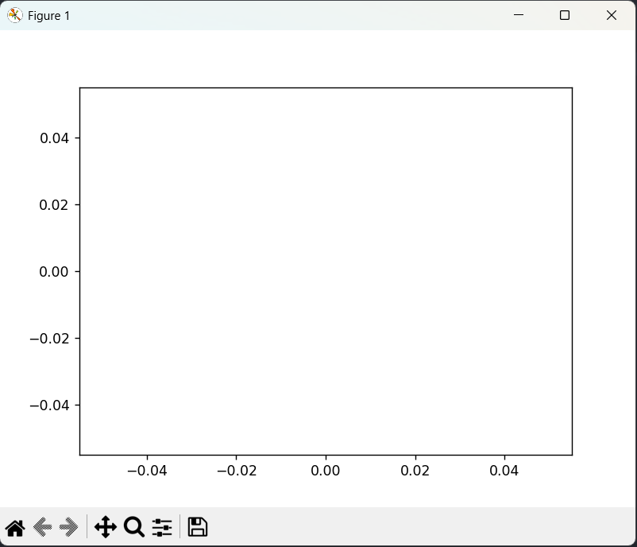
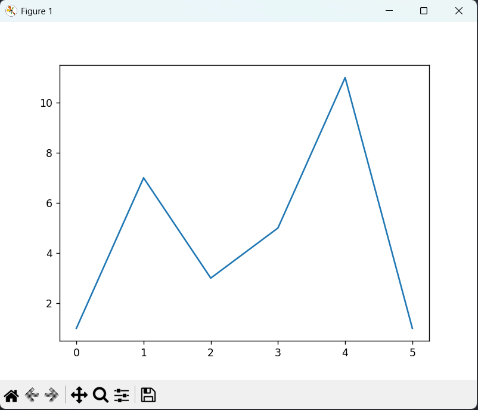
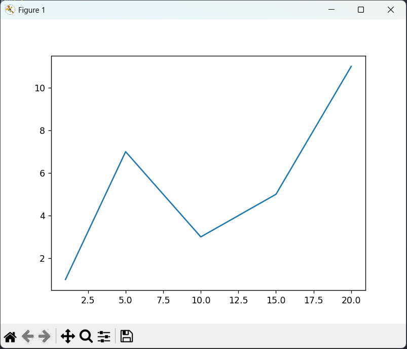
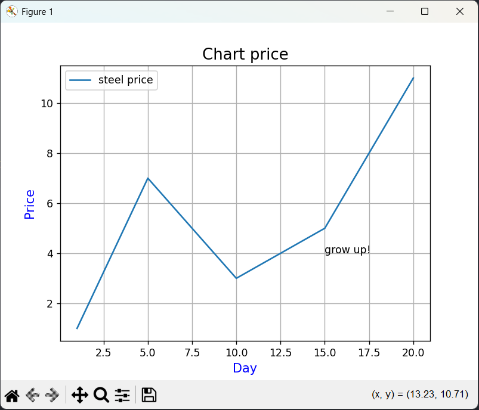
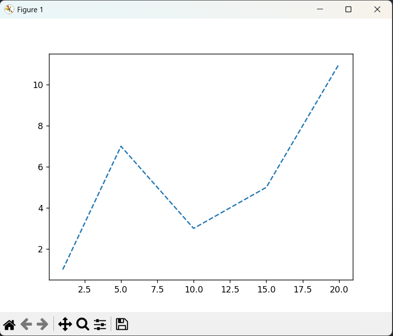
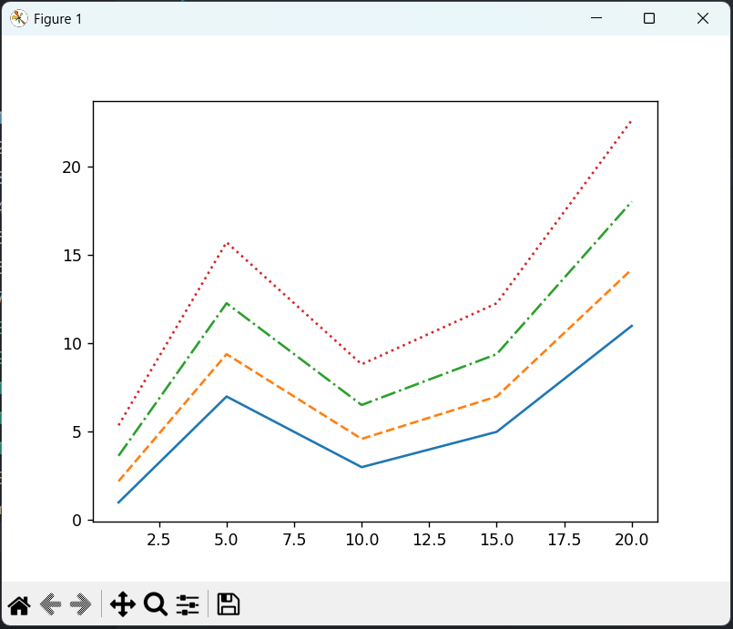
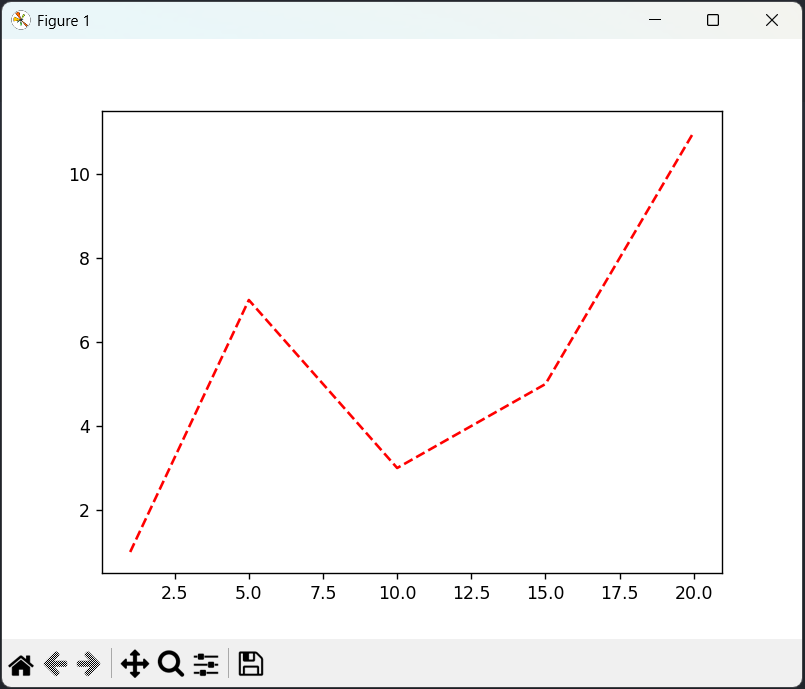
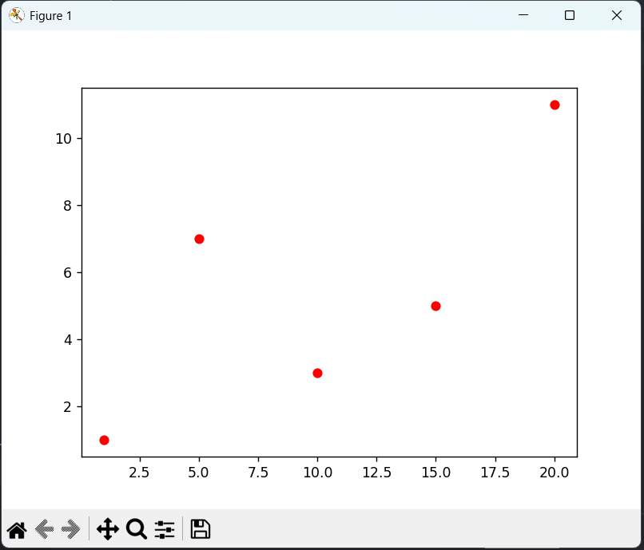
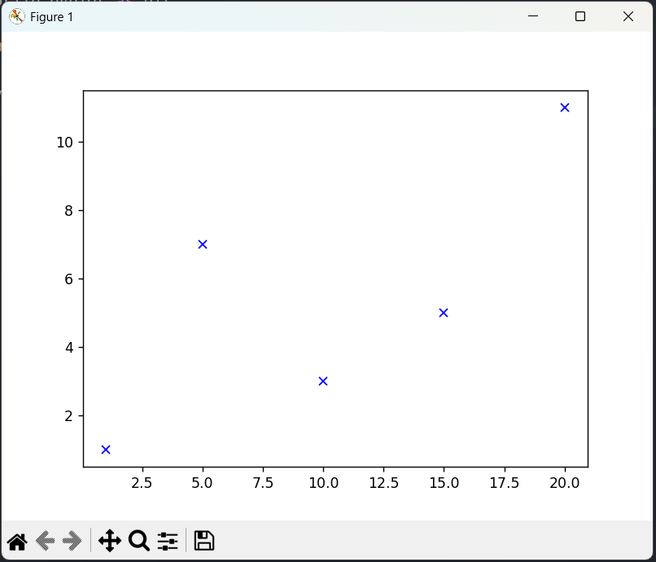
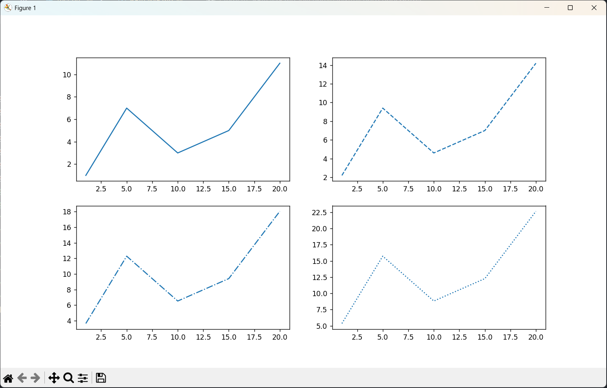

# Отчёт
## Урок 1
```python
import matplotlib.pyplot as plt
plt.plot([1, 2, 3, 4, 5], [1, 2, 3, 4, 5])
plt.show()
```

```python
import matplotlib.pyplot as plt
import numpy as np

# Независимая (x) и зависимая (y) переменные
x = np.linspace(0, 10, 50)
y = x
# Построение графика
plt.title('Линейная зависимость y = x') # заголовок
plt.xlabel('x') # ось абсцисс
plt.ylabel('y') # ось ординат
plt.grid() # включение отображение сетки
plt.plot(x, y) # построение графика
plt.show()
```

```python
import matplotlib.pyplot as plt
import numpy as np

# Независимая (x) и зависимая (y) переменные
x = np.linspace(0, 10, 50)
y = x
# Построение графика
plt.title('Линейная зависимость y = x') # заголовок
plt.xlabel('x') # ось абсцисс
plt.ylabel('y') # ось ординат
plt.grid() # включение отображение сетки
plt.plot(x, y, 'r--') # построение графика

plt.show()
```

```python
import matplotlib.pyplot as plt
import numpy as np

# Линейная зависимость
x = np.linspace(0, 10, 50)
y1 = x
# Квадратичная зависимость
y2 = x**2

# Построение графика
plt.title('Зависимости: y1 = x, y2 = x^2') # заголовок
plt.xlabel('x') # ось абсцисс
plt.ylabel('y1, y2') # ось ординат
plt.grid() # включение отображение сетки
plt.plot(x, y1, x, y2) # построение графика

plt.show()
```

```python
import matplotlib.pyplot as plt
import numpy as np

# Линейная зависимость
x = np.linspace(0, 10, 50)
y1 = x
# Квадратичная зависимость
y2 = x**2

# Построение графиков
plt.figure(figsize=(9, 9)) # размер общего поля

plt.subplot(2, 1, 1) # местоположение поля с графиком
plt.plot(x, y1) # построение графика
plt.title('Зависимости: y1 = x, y2 = x^2') # заголовок
plt.ylabel('y1', fontsize=14) # ось ординат
plt.grid(True) # включение отображение сетки

plt.subplot(2, 1, 2)
plt.plot(x, y2) # построение графика
plt.xlabel('x', fontsize=14) # ось абсцисс
plt.ylabel('y2', fontsize=14) # ось ординат
plt.grid(True) # включение отображение сетки

plt.show()
```

```python
import matplotlib.pyplot as plt
import numpy as np

fruits = ['apple', 'peach', 'orange', 'bannana', 'melon']
counts = [34, 25, 43, 31, 17]
plt.bar(fruits, counts) # вывод диаграммы
plt.title('Fruits!')
plt.xlabel('Fruit')
plt.ylabel('Count')

plt.show()
```

```python
import matplotlib.pyplot as plt
from matplotlib.ticker import (MultipleLocator, FormatStrFormatter,
AutoMinorLocator)
import numpy as np

x = np.linspace(0, 10, 10)
y1 = 4*x
y2 = [i**2 for i in x]

fig, ax = plt.subplots(figsize=(8, 6))

ax.set_title('Графики зависимостей: y1=4*x, y2=x^2', fontsize=16)
ax.set_xlabel('x', fontsize=14)
ax.set_ylabel('y1, y2', fontsize=14)
ax.grid(which='major', linewidth=1.2)
ax.grid(which='minor', linestyle='--', color='gray', linewidth=0.5)
ax.scatter(x, y1, c='red', label='y1 = 4*x')
ax.plot(x, y2, label='y2 = x^2')
ax.legend()

ax.xaxis.set_minor_locator(AutoMinorLocator())
ax.yaxis.set_minor_locator(AutoMinorLocator())
ax.tick_params(which='major', length=10, width=2)
ax.tick_params(which='minor', length=5, width=1)

plt.show()
```

## Урок 2
```python
import matplotlib.pyplot as plt
plt.plot()
plt.show()
```

```python
import matplotlib.pyplot as plt
plt.plot([1, 7, 3, 5, 11, 1])
plt.show()
```

```python
import matplotlib.pyplot as plt
plt.plot([1, 5, 10, 15, 20], [1, 7, 3, 5, 11])
plt.show()
```

```python
import matplotlib.pyplot as plt

x = [1, 5, 10, 15, 20]
y = [1, 7, 3, 5, 11]
plt.plot(x, y, label='steel price')
plt.title('Chart price', fontsize=15)
plt.xlabel('Day', fontsize=12, color='blue')
plt.ylabel('Price', fontsize=12, color='blue')
plt.legend()
plt.grid(True)
plt.text(15, 4, 'grow up!')

plt.show()
```

```python
import matplotlib.pyplot as plt
x = [1, 5, 10, 15, 20]
y = [1, 7, 3, 5, 11]
plt.plot(x, y, '--')
plt.show()
```
```python
import matplotlib.pyplot as plt
x = [1, 5, 10, 15, 20]
y = [1, 7, 3, 5, 11]
line = plt.plot(x, y)
plt.setp(line, linestyle='--')
plt.show()
```

```python
import matplotlib.pyplot as plt

x = [1, 5, 10, 15, 20]
y1 = [1, 7, 3, 5, 11]
y2 = [i*1.2 + 1 for i in y1]
y3 = [i*1.2 + 1 for i in y2]
y4 = [i*1.2 + 1 for i in y3]
plt.plot(x, y1, '-', x, y2, '--', x, y3, '-.', x, y4, ':')

plt.show()
```
```python
import matplotlib.pyplot as plt

x = [1, 5, 10, 15, 20]
y1 = [1, 7, 3, 5, 11]
y2 = [i*1.2 + 1 for i in y1]
y3 = [i*1.2 + 1 for i in y2]
y4 = [i*1.2 + 1 for i in y3]
plt.plot(x, y1, '-')
plt.plot(x, y2, '--')
plt.plot(x, y3, '-.')
plt.plot(x, y4, ':')

plt.show()
```

```python
import matplotlib.pyplot as plt

x = [1, 5, 10, 15, 20]
y = [1, 7, 3, 5, 11]
plt.plot(x, y, '--r')

plt.show()
```

```python
import matplotlib.pyplot as plt
x = [1, 5, 10, 15, 20]
y = [1, 7, 3, 5, 11]
plt.plot(x, y, 'ro')
plt.show()
```

```python
import matplotlib.pyplot as plt
x = [1, 5, 10, 15, 20]
y = [1, 7, 3, 5, 11]
plt.plot(x, y, 'bx')
plt.show()
```

```python
import matplotlib.pyplot as plt

# Исходный набор данных
x = [1, 5, 10, 15, 20]
y1 = [1, 7, 3, 5, 11]
y2 = [i*1.2 + 1 for i in y1]
y3 = [i*1.2 + 1 for i in y2]
y4 = [i*1.2 + 1 for i in y3]
# Настройка размеров подложки
plt.figure(figsize=(12, 7))
# Вывод графиков
plt.subplot(2, 2, 1)
plt.plot(x, y1, '-')
plt.subplot(2, 2, 2)
plt.plot(x, y2, '--')
plt.subplot(2, 2, 3)
plt.plot(x, y3, '-.')
plt.subplot(2, 2, 4)
plt.plot(x, y4, ':')

plt.show()
```
```python
import matplotlib.pyplot as plt

# Исходный набор данных
x = [1, 5, 10, 15, 20]
y1 = [1, 7, 3, 5, 11]
y2 = [i*1.2 + 1 for i in y1]
y3 = [i*1.2 + 1 for i in y2]
y4 = [i*1.2 + 1 for i in y3]
# Настройка размеров подложки
plt.figure(figsize=(12, 7))
# Вывод графиков
plt.subplot(221)
plt.plot(x, y1, '-')
plt.subplot(222)
plt.plot(x, y2, '--')
plt.subplot(223)
plt.plot(x, y3, '-.')
plt.subplot(224)
plt.plot(x, y4, ':')

plt.show()
```
```python
import matplotlib.pyplot as plt

# Исходный набор данных
x = [1, 5, 10, 15, 20]
y1 = [1, 7, 3, 5, 11]
y2 = [i*1.2 + 1 for i in y1]
y3 = [i*1.2 + 1 for i in y2]
y4 = [i*1.2 + 1 for i in y3]
# Вывод графиков
fig, axs = plt.subplots(2, 2, figsize=(12, 7))
axs[0, 0].plot(x, y1, '-')
axs[0, 1].plot(x, y2, '--')
axs[1, 0].plot(x, y3, '-.')
axs[1, 1].plot(x, y4, ':')

plt.show()
```

## Урок 3