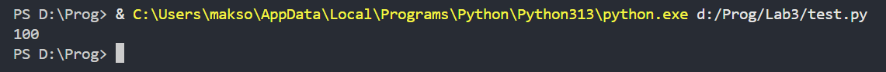
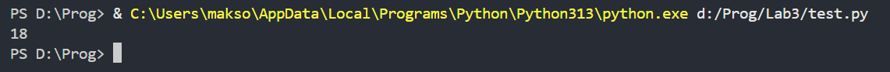
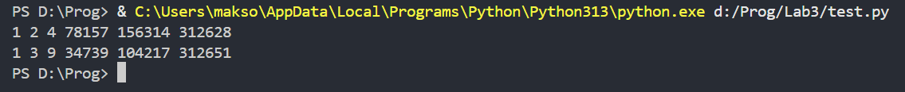
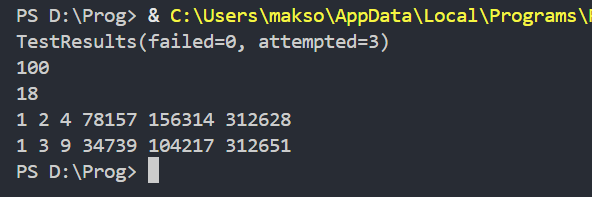

# Отчёт (вариант 9)
# Сложность Rare
## Задание 1
Олег составляет таблицу кодовых слов для передачи сообщений, каждому сообщению соответствует своё кодовое слово. В качестве кодовых слов Олег использует 4-буквенные слова, в которых есть только буквы A, B, C, D, E, X, Z, причём буквы X и Z встречаются только на двух первых позициях, а буквы A, B, C, D, E  — только на двух последних. Сколько различных кодовых слов может использовать Олег?
```python
from itertools import product
def z1():
    s1 = ['X', 'Z']
    s2 = ['A', 'B', 'C', 'D', 'E']
    cnt = 0
    for a1, a2, a3, a4 in product(s1, s1, s2, s2):
        cnt += 1
    print(cnt)
```
Создадим два множества: в первом буквы, которые встречаются только на двух первых позициях, а во втором те буквы, которые встречаются только на двух последних позициях. С помощью цикла for и функции product библиотеки itertools пройдёмся по всем вариантам слов, перыми двумя буквами которых будут буквы из множества 1, а последними двумя будут буквы из множества 2, и посчитаем их количество.

## Задание 2
Значение арифметического выражения 49^10 + 7^39 - 49 записали в системе счисления с основанием 7. Сколько цифр 6 содержится в этой записи?
```python
def z2():
    s = 49**10 + 7**30 - 49
    list = []
    while s > 0:
        list.append(s % 7)
        s //= 7
    print(list.count(6))
```
Запишем значение выражения в переменную s.
Путём записи остатков от деления выражения на 7 в список list и изменения значения переменной s на значение поделённоё до целого числа на 7 до тех пор, пока выражение будет больше нуля, получим список, являющийся исходным выражением записанном в системе счисления с основанием 7, но задом на перёд, но для решения задачи это неважно. С помощью функции count посчитаем количество элементов списка со значением 6.

## Задание 3
Найдите среди целых чисел, принадлежащих числовому отрезку [312614; 312651], числа, имеющие ровно шесть различных натуральных делителей. Для каждого найденного числа запишите эти шесть делителей в шесть соседних столбцов на экране с новой строки. Делители в строке должны следовать в порядке возрастания.
```python
def z3():
    for x in range(312614, 312652):
        list = []
        for i in range(1, x + 1):
            if x % i == 0:
                list.append(i)
        if len(list) == 6:
            print(*sorted(list))
```
Пройдёмся циклом for по указанному числовому отрезку. Для каждого x проверим остаток от деления на все числа от 1 до x, и если остаток от деления равен нулю, то добавим делитель i в список list. Проверив так все i для одного x, если длинна списка делителей равна 6, то выведем его через функцию sorted, для того чтобы делители распологались в порядке возростания. Также добавим символ * для того чтобы элементы списка вывелись через пробел.

# Сложность Medium
Задание: написать для функций доктесты. Для этого импортируем doctest и напишем для каждой функции доктесты. В конце выведем результаты доктестов.
```python
from itertools import product
import doctest

def z1():
    '''
    >>> z1()
    100
    '''
    s1 = ['X', 'Z']
    s2 = ['A', 'B', 'C', 'D', 'E']
    cnt = 0
    for a1, a2, a3, a4 in product(s1, s1, s2, s2):
        cnt += 1
    print(cnt)

def z2():
    '''
    >>> z2()
    18
    '''
    s = 49**10 + 7**30 - 49
    list = []
    while s > 0:
        list.append(s % 7)
        s //= 7
    print(list.count(6))

def z3():
    '''
    >>> z3()
    1 2 4 78157 156314 312628
    1 3 9 34739 104217 312651
    '''
    for x in range(312614, 312652):
        list = []
        for i in range(1, x + 1):
            if x % i == 0:
                list.append(i)
        if len(list) == 6:
            print(*sorted(list))

print(doctest.testmod())
z1()
z2()
z3()
```
Результат

