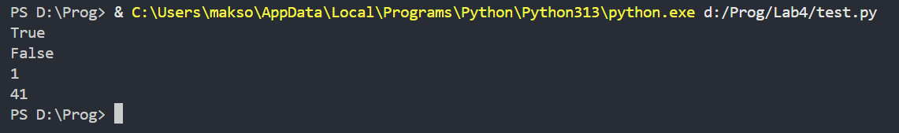

# Отчёт (Вариант 9)
## Задача 1
Функция, определяющая, является ли последовательностть палиндромом.
### Функции без использования рекурсии
```python
def is_palindrom(list):
    if list == list[::-1]:
        return True
    else:
        return False
```
Функция проверяет на равенство исходную и перевёрнутую (записанную задом на перёд) последовательность. Если последовательности равны, то функция возвращает значение True, иначе возвращает значение False.
### Функция с использованием рекурсией
```python
def is_palindrom_rec(list):
    if len(list) <= 1:
        return True
    if list[0] != list[-1]:
        return False
    return is_palindrom_rec(list[1: -1])
```
Функция проверяет длинну последовательности (если длинна меньше либо равна 1, то последовательность является палиндромом) и сравнивает первый и последний элемент последовательности (если они не равны, то последовательность не является палиндромом). После первой проверки на эти два пункта, функция вызывает саму себя, но в качестве аргумента в неё передаётся уже последовательность без первого и последнего элемента и снова проверяет её на длинну и равенство крайних элементов, затем тоже самое делается для последовательности без двух первых и последних элементов и т.д.. Это повторяется пока одно из условий не окажется верным, что скажет нам является ли последовательность палиндромом.
## Задача 2
Функция для вычисления x(i) = x(i-1) + x(i-3), x(1) = x(2) = x(3) = 1
### Функции без использования рекурсии
```python
def get_x(i):
    if i <= 3:
        return 1
    x_1 = 1
    x_2 = 1
    x_3 = 1
    for n in range(4, i+1):
        x_i = x_3 + x_1
        x_1 = x_2
        x_2 = x_3
        x_3 = x_i
    return x_i
```
Первым делом, создадим условие, при котором функция будем возвращать значение 1, если номер элемента последовательносити меньше либо равен 3. Создадим переменные x_1, x_2, x_3 и присвоим им зачение 1. Создадим цикл for перебирающий значения от 4 до i и в каждой итерации цикла будем постепенно просчитывать все элементы последвательности вплоть до i-ого элемента. Для этого будем создавать переменную x_i и присваивать ей значение x_3 + x_1, затем заменять значение переменной x_1 на значение переменной x_2, значение переменной x_2 на значение x_3 и значение x_3 на x_i. Тем самым, храня значения последних 3-х элементов последовательности для просчёта следующих, мы будем какбы двигаться по числовой оси к i-ому элементу последовательности. Когда цикл завершится, функция вернёт последнее присвоенное переменной x_i значение.
### Функция с использованием рекурсией
```python
def get_x_rec(i):
    if i <= 3:
        return 1
    return get_x_rec(i-1) + get_x_rec(i-3)
```
Создадим условие, при котором функция будем возвращать значение 1, если номер элемента последовательносити меньше либо равен 3.
Если же номер элемента больше 3, то функция будет рекурсивно вызывать саму себя, передавая в качестве аргумента значения (i - 1) и (i - 3). Просчитав так все элементы до i = 3, мы получим значения нужных элементов последовательности, сумма которых и будет являться ответом.
## Результаты
```python
print(is_palindrom([1,2,3,2,1]))
print(is_palindrom_rec([1,2,3,2]))
print(get_x(3))
print(get_x_rec(12))
```
Данный код вывведет
