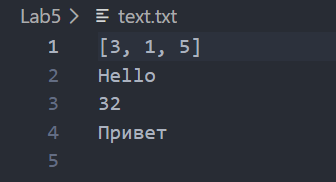
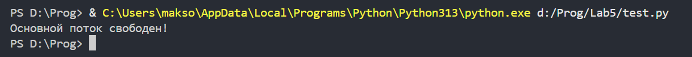

# Отчёт
## Вариант 9
## 1) Замыкание для записи всех значений в файл
```python
def create_file_logger(filename):
    file = open(filename, 'a', encoding='utf-8')
    def logger(value):
        file.write(f"{value}\n")
        file.flush()
        return f"Записано: {value}"
    return logger

log = create_file_logger("Lab5/text.txt")
```
Создадим внешнюю функцию create_file_logger, которая будет создавать файл в режиме добавления. Используем encoding='utf-8' для корректной записи кирилицы. Создадим внутреннюю функцию logger, которая будет иметь доступ к переменной file и записывать в неё переданное значение. Для удобства воспользуемся методом flush, чтобы данные сохранялись в файле немедленно, не дожидаясь закрытия программы. Внутрення функция будет возвращать записанное в файл значение, а внешняя будет возвращать внутреннюю функцию. На нашу функцию будем ссылаться переменной log. Тем самым, мы создадим замыкание.
```python
log([3, 1, 5])
log('Hello')
log(32)
log('Привет')
```
Для примера, добавим к нашему коду эти 4 строки. Результатом будет файл text.txt, в котором будут записаны значения, передаваемые в качестве аргумента функции.


## 2) Декоратор для асинхронного выполнения функции.
```python
import threading

def run_async(func):
    def wrapper(*args, **kwargs):
        thread = threading.Thread(target=func, args=args, kwargs=kwargs)
        thread.start()
        return thread
    return wrapper
```
Создадим декоратор для асинхронного выполнения функции. Для этого импортируем библиотеку threading, которая позволит программе выполнять несколько задач одновременно (параллельно) в рамках одного процесса. Создадим функцию run_async, которая будет получать функцию logger как аргумент func. Внутри себя она определяет новую функцию wrapper, которая будет вызываться вместо оригинальной, позволяя выполнить дополнительный код до или после её запуска. Благодаря записи *args и **kwargs, wrapper принимает любые данные, которые передаются в log(). Она какбы говорит: «Я заберу эти данные и сама решу, что с ними делать». Вместо того чтобы просто выполнить код записи в файл (как сделала бы обычная функция), wrapper упаковывает этот код в новый поток threading.Thread. Она передает оригинальную функцию func и все аргументы в этот поток и запускает его. Как только поток запущен, wrapper завершает свою работу. Она не ждет, пока файл запишется. Именно благодаря этому основной код программы продолжает работать без задержек.
```python
def create_file_logger(filename):
    file = open(filename, 'a', encoding='utf-8')
    @run_async
    def logger(value):
        file.write(f"{value}\n")
        file.flush()
        return f"Записано: {value}"
    return logger
```
Применим декоратор к нашему замыканию.
```python
log = create_file_logger("Lab5/text.txt")

log([3, 1, 5])
log('Hello')
log(32)
log('Привет')
print("Основной поток свободен!")
```
Результатом этого кода также будет файл text.txt, в котором будут записаны значения, передаваемые в качестве аргумента функции, но теперь их запись будет происходить в отдельном потоке, благодаря чему параллельно с выполнением функции записи значений в файл, не дожидаясь окончания её выполнения, выполнится метод print, который выведет текст в терминал.
