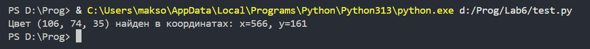
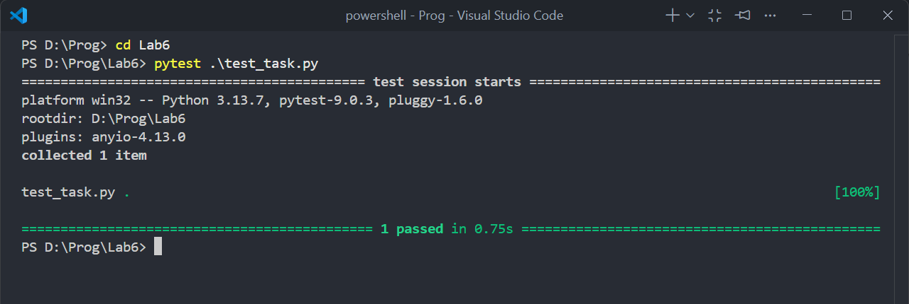

# Отчёт (Вариант 9)
## Попискельный генератор для растровых изображений.
# Сложность Rare
```python
from PIL import Image
```
Импортируем библиотеку Pillow (PIL).
```python
def pixel_generator(image_path):
    with Image.open(image_path) as img:
        rgb_img = img.convert('RGB')
        width, height = rgb_img.size
        for y in range(height):
            for x in range(width):
                yield (x, y), rgb_img.getpixel((x, y))
```
Создадим функцию pixel_generator, которая будет генерировать координаты и цвет каждого пикселя изображения. Откроем нужное изображение переданное в качестве аргумента функции и, на всякий случай, принудительно переведём его в RGB формат, чтобы генератор всегда выдавал предсказуемый результат - кортеж из трех чисел (Red, Green, Blue). Далее пройдёмся циклом for по всем пикселям изображения и узнаем их цвет. Используя yield гигантский массив всех пикселей не загружается в список, а изображение обрабатывается потоком, и если нужно найти пиксель конкретного цвета, то не нужно будет проходить по всему файлу целиком.
```python
target_color = (106, 74, 35)
found = False
for (x, y), color in pixel_generator('Lab6/picture.jpg'):
    if color == target_color:
        print(f"Цвет {target_color} найден в координатах: x={x}, y={y}")
        found = True
        break
if not found:
    print("Такого цвета в изображении нет")
```
Для примера найдём координаты пикселя с цветом (106, 74, 35).

# Сложность Medium
У нас есть файл task с иходным кодом задания. Слегка изменим его, обернув всё задание в одну функцию task.
```python
from PIL import Image

def task(target_color):
    def pixel_generator(image_path):
        with Image.open(image_path) as img:
            rgb_img = img.convert('RGB')
            width, height = rgb_img.size
            for y in range(height):
                for x in range(width):
                    yield (x, y), rgb_img.getpixel((x, y))
    
    found = False
    for (x, y), color in pixel_generator('picture.jpg'):
        if color == target_color:
            print(f"Цвет {target_color} найден в координатах: x={x}, y={y}")
            found = True
            break
    if not found:
        print("Такого цвета в изображении нет")

    return found
```
Создадим файл test_task, в котором будут написаны тесты для нашего кода.
```python
from task import task

def test_task():
    assert task((106, 74, 35))
    assert task((17,19,18))
    assert task((54,35,21))
    assert not task((170,113,39))
    assert not task((154,167,167))
```
Запустим тест через терминал

Результат: все тесты пройдены успешно.