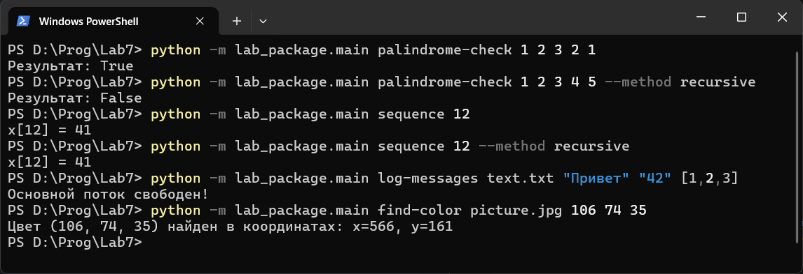
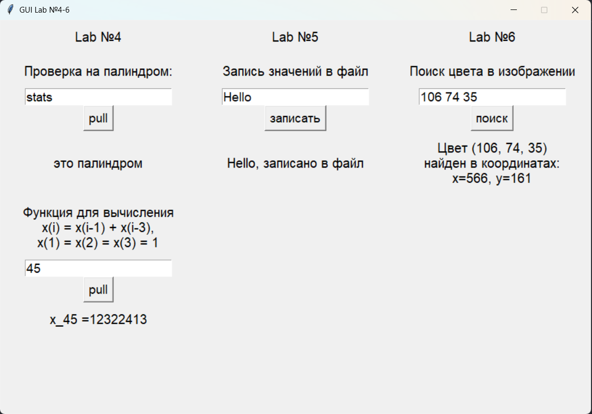

# Отчёт
## Задача:
Создать пакет, содержащий 3 модуля на основе лабораторных работ №4-6. Написать запускающий модуль на основе Typer, который позволит выбирать и настраивать параметры запуска логики из пакета.
# Сложность Rare
Создадим папку lab_package, в ней создадим файл init.py.
```python
from .palindrome import is_palindrom, is_palindrom_rec, get_x, get_x_rec
from .logger import run_async, create_file_logger
from .image_processor import pixel_generator, find_color_in_image
__all__ = [
    'is_palindrom', 'is_palindrom_rec', 'get_x', 'get_x_rec', 
    'run_async', 'create_file_logger', 
    'pixel_generator', 'find_color_in_image'
    ]
```
В файле init.py создадим пакет для лабораторных работ №4-6, содержащий модули на их основе.

Файл palindrome.py будет являться модулем для работы с палиндромами и последовательностями на основе лабораторной работы №4.
```python
def is_palindrom(list):
    if list == list[::-1]:
        return True
    else:
        return False

def is_palindrom_rec(list):
    if len(list) <= 1:
        return True
    if list[0] != list[-1]:
        return False
    return is_palindrom_rec(list[1: -1])

def get_x(i):
    if i <= 3:
        return 1
    x_1 = 1
    x_2 = 1
    x_3 = 1
    for n in range(4, i+1):
        x_i = x_3 + x_1
        x_1 = x_2
        x_2 = x_3
        x_3 = x_i
    return x_i

def get_x_rec(i):
    if i <= 3:
        return 1
    return get_x_rec(i-1) + get_x_rec(i-3)
```
Файл logger.py будет являться модулем для ассинхронной записи значений в файл на основе лабораторной работы №5.
```python
import threading

def run_async(func):
    def wrapper(*args, **kwargs):
        thread = threading.Thread(target=func, args=args, kwargs=kwargs)
        thread.start()
        return thread
    return wrapper

def create_file_logger(filename):
    file = open(filename, 'a', encoding='utf-8')
    @run_async
    def logger(value):
        file.write(f"{value}\n")
        file.flush()
        return f"Записано: {value}"
    return logger
```
Файл image_processor.py будет являться модулем для обработки изображений на основе лабораторной работы №6.
```python
from PIL import Image

def pixel_generator(image_path):
    with Image.open(image_path) as img:
        rgb_img = img.convert('RGB')
        width, height = rgb_img.size
        for y in range(height):
            for x in range(width):
                yield (x, y), rgb_img.getpixel((x, y))

def find_color_in_image(image_path, target_color):
    found = False
    for (x, y), color in pixel_generator('Lab6/picture.jpg'):
        if color == target_color:
            print(f"Цвет {target_color} найден в координатах: x={x}, y={y}")
            found = True
            break
    if not found:
        print("Такого цвета в изображении нет")
    return found
```
Файл main.py будет являться запускающим модулем на основе Typer, позволяющим выбирать и настраивать параметры запуска логики из пакета.
```python
import typer
from typing import List
from lab_package import (
    is_palindrom, is_palindrom_rec, get_x, get_x_rec,
    create_file_logger,
    find_color_in_image
    )

app = typer.Typer()

@app.command()
def palindrome_check(numbers: List[int], method: str = "iterative"):
    from lab_package import is_palindrom, is_palindrom_rec
    if method == "iterative":
        result = is_palindrom(numbers)
    else:
        result = is_palindrom_rec(numbers)
    typer.echo(f"Результат: {result}")

@app.command()
def sequence(index: int, method: str = "iterative"):
    from lab_package import get_x, get_x_rec
    if method == "iterative":
        result = get_x(index)
    else:
        result = get_x_rec(index)
    typer.echo(f"x[{index}] = {result}")

@app.command()
def log_messages(filepath: str, messages: List[str]):
    from lab_package import create_file_logger
    log = create_file_logger(filepath)
    for msg in messages:
        log(msg)
    typer.echo("Основной поток свободен!")

@app.command()
def find_color(image_path: str, red: int, green: int, blue: int):
    from lab_package import find_color_in_image
    find_color_in_image(image_path, (red, green, blue))

if __name__ == "__main__":
    app()
```
В нём импортируем библиотеку typer, тип List для анотации списков и все функции из всех модулей пакета. Создадим главный объект в приложении app. Создадим 4 функции, работающие на основе функций из лабораторных работ и применим к ним декоратор @app.command(), чтобы сделать эти функции командой для командной строки.


Результат
# Сложность Medium
Создадим файл app.py, в котором реализуем GUI приложение, на основе модулей лабораторной работы с помощью библиотеки tkinter.
```python
from tkinter import *
from palindrome import is_palindrom, is_palindrom_rec, get_x, get_x_rec
from logger import create_file_logger
from image_processor import find_color_in_image
```
Импортируем все нужные модули и библиотеки
```python
root = Tk()
root.title("GUI Lab №4-6")
root.geometry("900x600")
root.resizable(width = False, height = False)
```
Создадим главное окно нашего приложения и настроим его основные параметры.
```python
root.grid_columnconfigure(0, minsize = 300)
root.grid_columnconfigure(1, minsize = 300)
root.grid_columnconfigure(2, minsize = 300)
```
Так как виджеты планируется распологать с помощью метода grid, для удобства сразу зададим минимальный размер столбцов, равный трети ширины окна приложения.
```python
Label_4 = Label(root, text = 'Lab №4', 
                font = "Arial 15",
                width = 26,
                height = 2
                ).grid(row = 0, column = 0)
Label_palindrom = Label(root, text = "Проверка на палиндром:", 
                font = "Arial 15",
                width = 26,
                height = 2
                ).grid(row = 1, column = 0)
Label_get_x = Label(root, text = "Функция для вычисления\nx(i) = x(i-1) + x(i-3),\nx(1) = x(2) = x(3) = 1", 
                font = "Arial 15",
                width = 26,
                height = 4
                ).grid(row = 5, column = 0)
Label_5 = Label(root, text = 'Lab №5', 
                font = "Arial 15",
                width = 26,
                height = 2
                ).grid(row = 0, column = 1)
Label_logger = Label(root, text = "Запись значений в файл", 
                font = "Arial 15",
                width = 26,
                height = 2
                ).grid(row = 1, column = 1)
Label_6 = Label(root, text = 'Lab №6', 
                font = "Arial 15",
                width = 26,
                height = 2
                ).grid(row = 0, column = 2)
Label_image = Label(root, text = "Поиск цвета в изображении", 
                font = "Arial 15",
                width = 26,
                height = 2
                ).grid(row = 1, column = 2)
```
Создадим и расположим на своих местах все виджеты класса Label. На них будет информация о номерах лабораторных работ, из которых взята логика, и краткое их описание.
```python
Lab4_E_palindrom = Entry(root, font = "Arial 14")
Lab4_E_get_x = Entry(root, font = "Arial 14")
Lab5_E = Entry(root, font = "Arial 14")
Lab6_E = Entry(root, font = "Arial 14")

Lab4_E_palindrom.grid(row = 2, column = 0)
Lab4_E_get_x.grid(row = 6, column = 0)
Lab5_E.grid(row = 2, column = 1)
Lab6_E.grid(row = 2, column = 2)
```
Создадим и расположим на своих местах виджеты класса Entry для ввода данных.
```python
def button_4_palindrom():
    arg = Lab4_E_palindrom.get()
    res = is_palindrom(arg)
    if res == 1:
        res = "это палиндром"
    elif res == 0:
        res = "это не палиндром"
    Res_4_palindrom = Label(root, text = res, 
                font = "Arial 15",
                width = 26,
                height = 2
                ).grid(row = 4, column = 0)

btn_lab4_palindrom = Button(root, 
                text = "pull", 
                command = button_4_palindrom,
                font = "Arial 14",
                ).grid(row = 3, column = 0)
```
Создадим кнопку btn_lab4_palindrom для проверки введённой в строку ввода данных последовательности на палиндром. Присвоим ей команду при нажатии button_4_palindrom. В ней будем получать значение введённое в Lab4_E_palindrom и передавать его в качестве аргумента в функцию is_palindrom. После чего создастся виджет класса Label, на котором будет информация о том, является ли последовательность палиндромом.
```python
def button_4_get_x():
    arg = Lab4_E_get_x.get()
    res = str(get_x(int(arg)))
    Res_4_get_x = Label(root, text = f'x_{arg} =' + res, 
                font = "Arial 15",
                width = 26,
                height = 2
                ).grid(row = 8, column = 0)

btn_lab4_get_x = Button(root, 
                text = "pull", 
                command = button_4_get_x,
                font = "Arial 14",
                ).grid(row = 7, column = 0)
```
Аналогично создадим кнопку btn_lab4_get_x.
```python
def button_5():
    arg = Lab5_E.get()
    res = create_file_logger('Lab7/text.txt')
    res(arg)
    Res_5 = Label(root, text = f'{arg}, записано в файл',
                font = "Arial 15",
                width = 26,
                height = 2
                ).grid(row = 4, column = 1)

btn_lab5 = Button(root, 
                text = "записать", 
                command = button_5,
                font = "Arial 14",
                ).grid(row = 3, column = 1)
```
Аналогично создадим кнопку btn_lab5.
```python
def button_6():
    arg = Lab6_E.get().split(' ')
    res = find_color_in_image((int(arg[0]), int(arg[1]), int(arg[2])))
    Res_6 = Label(root, text = res,
                font = "Arial 15",
                width = 26,
                height = 4
                ).grid(row = 4, column = 2)

btn_lab6 = Button(root, 
                text = "поиск", 
                command = button_6,
                font = "Arial 14",
                ).grid(row = 3, column = 2)
```
Аналогично создадим кнопку btn_lab6.
```python
root.mainloop()
```
В конце кода добавим mainloop.

Результатом работы нашего приложения будет следующее окно
