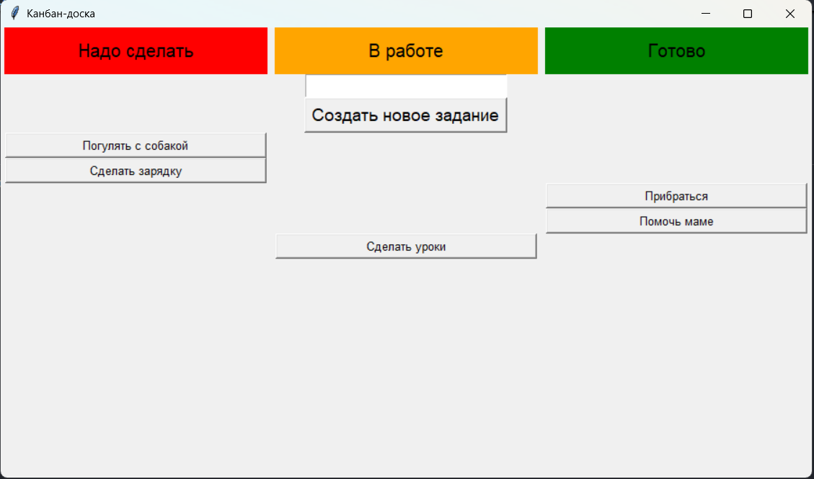

# Отчёт
## Вариант 9 (Канбан-доска)
```python
from tkinter import *
```
Для создания приложения будем использовать библиотеку tkinter.
```python
root = Tk()
```
Создадим главное окно root, на котором будем размещать все будущие виджеты.
```python
root.title("Канбан-доска")
root.geometry("900x500")
root.minsize(900,500)
root.resizable(width = False, height = True)
```
Добавим название приложения, укажем изначальный и минимальный размер окна. Уберём возможность растягивать окно по ширине, но оставим возможность растягивать его по высоте.
```python
root.grid_columnconfigure(0, minsize = 300)
root.grid_columnconfigure(1, minsize = 300)
root.grid_columnconfigure(2, minsize = 300)
```
В нашем случае будет удобно распологать виджеты с помощью метода grid, поэтому сразу укажем минимальный размер столбцов.
```python
label_1 = Label(root, text = "Надо сделать", 
                font = "Arial 15", 
                bg = "red",
                width = 26,
                height = 2
                ).grid(row = 0, column = 0)
label_2 = Label(root, text = "В работе", 
                font = "Arial 15", 
                bg = "orange",
                width = 26,
                height = 2
                ).grid(row = 0, column = 1)
label_3 = Label(root, text = "Готово", 
                font = "Arial 15", 
                bg = "green",
                width = 26,
                height = 2
                ).grid(row = 0, column = 2)
```
Создадим три объекта класса Label. Укажем отображаемый на них текст, его шрифт и размер, цвет виджетов, ширину, высоту, и с помощью метода grid расположим эти обьекты на нулевой строке каждого столбца. Это будут заголовки колонок нашей канбан-доски.
```python
name_task = Entry(root, font = "Arial 14")
name_task.grid(row = 1, column = 1)
```
Создадим объект name_task класса Entry - это будет строка ввода названий новых задач. Расположим её в первом столбце первой строки.
```python
btn_task = Button(root, 
                text = "Создать новое задание", 
                command = button,
                font = "Arial 14",
                ).grid(row = 2, column = 1)
```
Создадим кнопку для добавления новых задач на канбан-доску. Это будет объект класса Button, назовём его btn_task. Добавим на него текст и укажем название срабатываемой при нажатии функции.
```python
def button():
    name = name_task.get()
    def click0():
        btn0.destroy()
        btn1.grid(column = 1)
    def click1():
        btn1.destroy()
        btn2.grid(column = 2)
    def click2():
        btn2.destroy()

    btn0 = Button(root, text = name,
             font = "Arial 10",
             width = 35,
             command = click0
             )
    btn1 = Button(root, text = name,
             font = "Arial 10",
             width = 35,
             command = click1
             )
    btn2 = Button(root, text = name,
             font = "Arial 10",
             width = 35,
             command = click2
             )
    btn0.grid(column = 0)
```
При нажатии будет срабатывать функция button. Эта функция будет создавать три кнопки, на которых будет отображаться текст, который был введён в строку ввода, в момент нажатия на кнопку добавления задачи. Первая кнопка сразу будет расмещаться в нулевой столбец. При нажатии на неё она удалит саму себя и разместит вторую кнопку в столбец 1. Вторая кнопка при нажатии будет аналогично самоуничтожаться, размещяя третью кнопку во второй столбец. Она же, в свою очередь, будет просто удаляться при нажатии на неё. Тем самым мы создадим эфект перемещения задач по колонкам канбан-доски.
```python
root.mainloop()
```
В конце кода добавим mainloop.
## Результат
